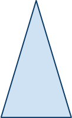
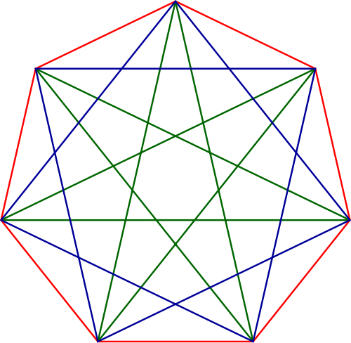
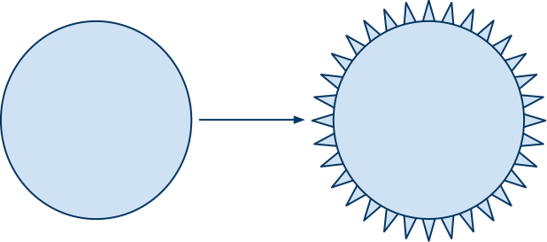
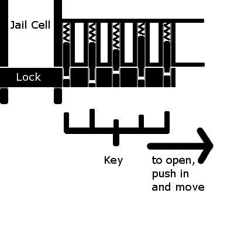

=================================
Original Functional Specification
=================================

Flatland Primer

Alex Lee
February 2nd, 2011
google docs

Overview
--------

Flatland Primer will be a game based on the novel *Flatland: A Romance of
Many Dimensions* by Edwin A. Abbott. The novel portrays a two dimensional
world where all of its inhabitants are either a line or a polygon. Whereas
the novel was a criticism on the Victorian society, this game will
reflect on the religious extremism in our current world.

Cast of Characters
------------------

The user will play a regular pentagon. It will be movable around the
screen with the mouse. When the user presses a button, the pentagon will
transform into a five-point star and begin rotating.

The isosceles triangles are soldiers. They have an ability to charge
forward like a rhino. When the user is in the way of the charge, the
user is deducted life points.

The equilateral triangles are the laborers. The squares are the middle
class. The hexagons are the lowest ranking loyalty.

The polygons with seven sides or more will be rarer. The heptagon will
transform into one of two heptagrams pictured below in blue or green. The
more acute heptagram (green) is also known as a fairy star to pagans. It
is also significant in ancient astrology. The religious aspect of the
heptagon will be considered.

The circles are the priests.

The Chief Circle is the final boss of the game. He will have the ability
to shape-shift like the image above. Also, he will be able to summon
soldiers (isosceles triangles). He will be significantly larger than
normal circles.

Game mechanics
--------------

The objective of each level is to get to the end from the starting
position. Unlike the traditional 2D, side-scrolling platform games
like Super Mario World or Castlevania, there is no gravity, hence no
jumping. However, there will be friction, which will make the characters
stop. In Flatland: The Movie, the characters moved in short bursts. The
NPCs will move in a similar fashion.

The player has a top-down view of the world. As the character moves
toward an edge of the window, all other elements will scroll, keeping the
character relatively in the center. If the character approaches an edge,
the scrolling will stop.

The characters will have health points, but they will not be displayed
as a bar graph. Each polygon will have a concentric but smaller polygons
of a lighter hue, like nested dolls. The number of inner polygons will
indicate the character's health.

When the player's character's health runs out, the game will display
"Game over," and return to the main menu.

When a character dies, the sides will fracture at the vertices and
drift away from the center. Most sides will fade to the background
color and disappear, but some sides will remain in the world. They
will be pick-up-able by the player to do so, the player must move the
character over a line fragment. When the line fragment is picked up,
the player's character will be healed a certain percentage and the
line should disappear.

Dialogs
-------

To narrate the story, speech bubbles will be overlaid. The intention is
to look and feel like a comic book. The speech bubbles should disappear
after a fixed time.

Collisions
----------

The collisions between objects will be handled with Newtonian mechanics
without rotational force. To simplify things further, the mass between
polygons will be equal.

Framing
-------

The game will be framed in levels and they will act as the primary
save points. When the program is first loaded, it should display a
menu. It should have a quit option, a level-select option, a start
game option, and options option (if need be).

Technical Note
~~~~~~~~~~~~~~

The state of the game will be stored in the folder $HOME/.config/flatland

Level Design
------------

The levels will be based on the following story line.

Story
-----

Flatland's ruling class, the circles have declared martial law and the
flatlanders who questioned the status quo have began to disappear. An
underground movement has formed, unbeknownst to the general public.

The traditionalists believe that only the observable is true. This has
been the position of the circles for two millenniums. Their doctrine
can be "briefly be summed up in a single maxim, ‘Attend to your
Configuration'" (Abbott). For generations and generations, the noble
circles ruled with absolute authority.

Meanwhile, the rebels believe in a higher plane of existence above
(and below) Flatland. In certain homes, there are shrines to Tetra,
the god of triangles. In other homes, there are homages to Cubes, and
so on. They believe they were created in their maker's image. This
difference between the rebel ranks have divided loyalties and weakened
their position.

Our hero, the pentagon, had been raised to believe in the
tradition. However, one fateful day, he is visited by the sphere.and
taken into the three dimensional world. Upon his return to Flatland,
he immediately begins shouting his revelation. When a priest hears his
words, he is swiftly arrested and taken to jail.

The first level starts from a jail cell. The pentagon gets sprung out
of the jail by the rebels, and with their help he escapes. The locking
mechanism on "doors" look like the following:

This mechanism will be reused in later levels.

The second level is a maze. Some parts of the maze will have Conway's
Game of Life embedded, which the user must navigate without touching
the "live" cells. The King of Pointland, as described in the novel,
will be there, talking to itself. Its monologue will solipsistic, that
is, it will use the word "me" excessively.

The third level will be staged in a prosthetics factory. The objective
will be to gather parts (pictured below) that will make a pentagon into
a circle. In the next level, these prosthetics will be used to sneak
into the inner sanctum of the circles.

The final level will involve confronting the Chief Circle and defeating
him in battle. The user will be locked in a room with the Chief Circle.

References
----------

#. Abbott, Edwin A. *Flatland: A Romance of Many Dimensions* (1884)
#. *Flatland: The Movie* (2007)
#. http://en.wikipedia.org/wiki/Heptagram
